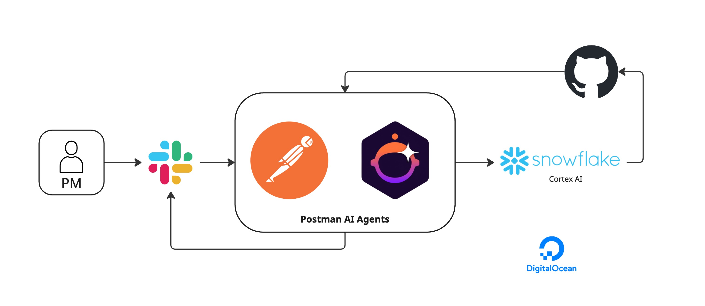

# Relay

Transform vague PM specs into actionable GitHub PRs and issues through intelligent workflow automation.

---

## Inspiration

Our project solves a real problem that we, SWE interns to PMs face: vague product requirements and incompatible interpretations. Engineers have to decode and figure out:

- Clarifying requirements back and forth
- Searching which files to change
- Writing acceptance criteria
- Creating boring boilerplate PRs

---

## What It Does

This is how our Agent System works:

1. **PM in Slack**: "Fix React version issue"
2. **Postman AI Agent** processes the request
3. **Ripgrep** finds relevant code files (Settings.tsx, theme.ts)
4. **Snowflake Cortex AI** generates PR code (≤30 lines)
5. **GitHub Issue** created automatically
6. **Slack** notifies team with reasoning trace
7. **Dashboard** shows history and the current usage of current PRs and Snowflake in general

**Result**: Issue + acceptance criteria + impacted files in 30 seconds.

---

## Architecture



**Flow**:
- PM submits request via Slack
- Postman AI Agents orchestrate the workflow
- Ripgrep searches codebase
- Snowflake Cortex AI generates PR content
- GitHub receives PR/Issue
- DigitalOcean hosts the deployment
- Slack notifies team with results

---

## Current Features

- **AI Agent Orchestration**: Autonomous workflow via Postman Flows with full reasoning transparency
- **Intelligent Code Search**: Fast ripgrep-based search with new feature detection
- **AI-Powered Generation**: Snowflake Cortex creates structured PRs with acceptance criteria (≤30 lines)
- **GitHub Integration**: Automated issue creation and PR generation with branching
- **Slack Interface**: `/relay` command with rich notifications and one-click navigation
- **Analytics Dashboard**: PR history, Snowflake usage tracking, and workflow metrics (POC)

---

## Tech Stack

Note: Many of our tech stack choices were influenced by the generosity of free tier, since it was a hackathon project. We still kept it as scalable as possible!

**Postman Flows**
- AI Agent Block (GPT-5 autonomous reasoning)
- Flow Modules (reusable tools)
- Actions (deployed with public URL)
- Analytics (tool call logging)

**Backend APIs**
- Ripgrep API (Node.js/Express code search)
- FastAPI backend (Snowflake Cortex integration)
- GitHub REST API (PR/issue creation)
- Slack Webhooks (Block Kit notifications)

**AI/LLM**
- Snowflake Cortex (Arctic LLM for PR generation)
- GPT-5 (Postman AI Agent orchestration)

**Infrastructure**
- DigitalOcean (deployment)
- Next.js (dashboard - proof of concept)

---

## Quick Start

### Prerequisites

- Postman Desktop (v11.42.3+)
- Node.js 18+
- GitHub Personal Access Token (`repo` scope)
- Slack App with Incoming Webhook
- Snowflake account with Cortex access

### Setup

**Full setup instructions**: See `SETUP.md`

**Quick start**:

1. **Clone repository**
   ```bash
   git clone https://github.com/V-prajit/relay.git
   cd relay
   ```

2. **Setup Ripgrep API**
   ```bash
   cd ripgrep-api
   npm install && npm run dev
   ```

3. **Setup Backend**
   ```bash
   cd backend
   pip install -r requirements.txt
   python -m uvicorn app.main:app --reload
   ```

4. **Configure Postman Flow**
   - Import modules from `postman/modules/`
   - Setup AI Agent with prompt from `postman/AI-AGENT-CONFIGURATION.md`
   - Deploy as Action

5. **Setup Slack**
   - Create slash command `/impact`
   - Point to Postman Action URL

6. **Test**
   ```
   /impact "Fix React version issue"
   ```

**Deployment**: Currently deployed on DigitalOcean. See `SETUP.md` for deployment instructions.

---

## Project Structure

```
relay/
├── postman/
│   ├── modules/              # 6 Flow Modules (AI Agent tools)
│   ├── AI-AGENT-CONFIGURATION.md
│   └── collections/          # API collections
├── ripgrep-api/              # Code search API (Node.js)
│   ├── src/
│   └── package.json
├── backend/                  # FastAPI backend (Snowflake integration)
│   ├── app/
│   │   ├── routes/          # API endpoints
│   │   └── services/        # Business logic
│   └── requirements.txt
├── frontend/                 # Dashboard (Next.js - POC)
├── docs/                     # Documentation and guides
├── architecture-diagram.jpg  # System architecture
├── README.md                 # This file
├── CLAUDE.md                 # Developer instructions
└── SETUP.md                  # Complete setup guide
```

---

## Future Feature Implementations

**DeepSeek OCR Integration**
- Context window expansion: 10x increase through optical compression technology
- Token efficiency: Compress 10 text tokens into 1 visual token (97% OCR precision)
- Large codebase support: Process entire repositories exceeding traditional LLM context limits
- Screenshot & mockup extraction: Extract code from design files and documentation images
- Structured document conversion and cost optimization through visual compression

**Elasticsearch Integration**
- Advanced code indexing and semantic search
- Faster search across large codebases
- Historical code pattern analysis

**Multi-Repository Support**
- Cross-repo dependency detection
- Unified PR creation across multiple repositories
- Repository relationship mapping

**Testing & CI/CD Integration**
- Automated test generation for PRs
- Sandbox environment creation and integration test execution
- Auto-trigger builds on PR creation with pre-merge validation
- Automated deployment to staging with rollback capabilities

**Advanced Conflict Detection**
- Co-change analysis (files that change together)
- Historical conflict patterns and predictive warnings
- Calendar integration for engineer availability

**Project Management Integration**
- Asana/Jira integration: Auto-create tasks from feature requests
- Link PRs to project milestones and assign based on code ownership
- Sync status updates across platforms

---

## Postman Flow Product Feedback

*These are feature requests and improvements we'd love to see in Postman Flows, based on our experience building this project.*

### Flow User Experience Improvements

**Customizable Timing & Constraints**
- Remove hardcoded time limits for long-running flows
- Configurable timeout settings per block
- Custom validation rules for flow inputs
- Team-specific workflow templates

**Environment Variable Management**
- Better variable management interface with bulk editing
- Role-based access control for sensitive variables
- Prevent concurrent edits with locking mechanism
- Conflict resolution notifications
- Variable version history and rollback

### Flow Quality & Feedback Systems

**User Feedback Loop**
- Built-in rating system for AI Agent outputs
- Quality tracking across flow executions
- Iterative improvement suggestions based on usage patterns
- Custom template library with community sharing

**Enhanced AI Agent Capabilities**
- Multi-model routing support (GPT-5 for orchestration, Claude for code)
- Specialized model selection per task type
- Cost optimization based on task complexity
- Token usage analytics and optimization suggestions

---

## Use Cases

### For PMs
- **Faster iteration**: Feature request → Issue/PR automatically
- **Better clarity**: Auto-generated acceptance criteria
- **Full visibility**: Reasoning trace shows every decision
- **Reduced back-and-forth**: Engineers get complete context upfront

### For Engineers
- **Less clarification needed**: All context provided in issue/PR
- **Conflict awareness**: Know about overlaps before coding
- **Ready to implement**: Files identified, requirements clear
- **Focus on coding**: Skip manual PR drafting

### For Teams
- **Reduced friction**: Eliminate lengthy clarification cycles
- **Async friendly**: PM requests don't block engineers
- **Audit trail**: Slack history + reasoning traces
- **Scalable process**: Handles multiple requests efficiently

---

## Troubleshooting

### Common Issues

**Ripgrep API not responding**:
```bash
cd ripgrep-api && npm run dev
curl http://localhost:3001/api/health
```

**Backend not responding**:
```bash
cd backend && python -m uvicorn app.main:app --reload
curl http://localhost:8000/health
```

**Postman Flow errors**:
- Check environment variables are set correctly
- Verify GitHub token has `repo` scope
- Ensure Slack webhook URL is correct
- See `docs/POSTMAN_FLOW_FIX_GUIDE.md`

**Slack command not working**:
- Reinstall Slack app
- Verify Request URL matches Postman Action URL
- Check webhook points to correct channel

**GitHub PR/Issue not created**:
- Verify `GITHUB_TOKEN` is valid
- Check repository name format: `owner/repo`
- See `GITHUB_PR_FIX.md` for recent fixes

**Detailed troubleshooting**: See `CLAUDE.md` for comprehensive guide.

---

## Contributing

See `CLAUDE.md` for development guidelines.

**Quick Guide**:
1. Create new Flow Module for new API integrations
2. Update AI Agent prompt to reference new tools
3. Add error handling and comprehensive documentation
4. Test end-to-end via Slack before committing

---

## Resources

**Documentation**:
- `SETUP.md` - Complete setup and deployment guide
- `CLAUDE.md` - Developer instructions and architecture
- `GITHUB_PR_FIX.md` - Recent bug fixes and solutions
- `postman/AI-AGENT-CONFIGURATION.md` - AI Agent configuration
- `docs/` - Additional troubleshooting guides

**Postman Resources**:
- [AI Agent Block](https://learning.postman.com/docs/postman-flows/reference/blocks/ai-agent/)
- [Flow Modules](https://learning.postman.com/docs/postman-flows/reference/modules/)
- [Deploy Actions](https://learning.postman.com/docs/postman-flows/build-flows/actions/)

**API Documentation**:
- [Snowflake Cortex](https://docs.snowflake.com/en/user-guide/snowflake-cortex)
- [GitHub REST API](https://docs.github.com/en/rest)
- [Slack Block Kit](https://docs.slack.dev/block-kit/)

---

## License

MIT License - See LICENSE file for details

---

## Team

**Shashank Yaji**
[LinkedIn](https://www.linkedin.com/in/shashankyaji/)

**Prajit Viswanadha**
[LinkedIn](https://www.linkedin.com/in/prajit-viswanadha/)

**Rabib Husain**
[LinkedIn](https://www.linkedin.com/in/rabib-husain/)

---

**GitHub**: https://github.com/V-prajit/relay

**Deployment**: Live on DigitalOcean
